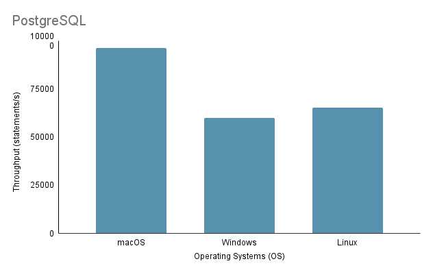

<div align=center>

# Shenzhen Metro

Metro Management System

SUSTech 2024 Spring Projects of `CS307 - Principles of Database System` Led by Professor [Yuxin MA](https://mayuxin.me/)

</div>

### Simplified Directory Path Diagram
```
Shenzhen-Metro
├── Project1                                                            # part 1 of project (database design and data import)
│   ├── ShenzhenMetroDatabaseDesign
│   │   ├── src
│   │   │   ├── main
│   │   │   │   ├── java                                                # import script in java
│   │   │   │   ├── resources                                           # data in json
│   │   │   │   └── sql                                                 # ddl
│   └── ShenzhenMetroDatabaseDesignPython
│       ├── import_script.py                                            # import script in python
│       └── resources                                                   # data in json
├── Project2                                                            # part 2 of project (building an api)
│   ├── DataImport                                                      # updated data import       
│   │   ├── src                                 
│   │   │   ├── main    
│   │   │   │   ├── java                                                # updated import script in java  
│   │   │   │   ├── resources                                           # updated data
│   │   │   │   └── sql                                                 # updated ddl
│   └── ShenzhenMetro                                                   # spring boot project
│       ├── src
│       │   ├── main
│       │   │   ├── java                                                # backend logic
│       │   │   │   └── com/sustech/cs307/project2/shenzhenmetro        
│       │   │   │       ├── ShenzhenMetroApplication.java               # main application driver
│       │   │   │       ├── controller                                  # api route mapping
│       │   │   │       ├── dto                                         # dto between client and server
│       │   │   │       ├── object                                      # orm between database tables and application code
│       │   │   │       ├── repository                                  # interfaces for data access
│       │   │   │       └── service                                     # service layer containing business logic
│       │   │   └── resources                                           # frontend logic
│       │   │       ├── application.properties                          # configuration file for spring boot application
│       │   │       ├── static
│       │   │       │   ├── assets
│       │   │       │   │   ├── css                                     
│       │   │       │   │   ├── img
│       │   │       │   │   ├── js
│       │   │       │   │   └── vendor
│       │   │       │   │       ├── aos
│       │   │       │   │       ├── bootstrap
│       │   │       │   │       ├── bootstrap-icons
│       │   │       │   │       ├── glightbox
│       │   │       │   │       └── swiper
│       │   │       │   └── index.html                                  # main html
│       │   │       └── templates                                   
│       │   │           ├── buses
│       │   │           │   ├── create_bus.html
│       │   │           │   ├── index.html
│       │   │           │   └── update_bus.html
│       │   │           ├── landmarks
│       │   │           │   ├── create_landmark.html
│       │   │           │   ├── index.html
│       │   │           │   └── update_landmark.html
│       │   │           ├── lineDetails
│       │   │           │   ├── create_line_detail.html
│       │   │           │   ├── index.html
│       │   │           │   ├── navigate_routes.html
│       │   │           │   └── search_line_detail.html
│       │   │           ├── lines
│       │   │           │   ├── create_line.html
│       │   │           │   ├── index.html
│       │   │           │   └── update_line.html
│       │   │           ├── ongoingRides
│       │   │           │   └── index.html
│       │   │           ├── rides
│       │   │           │   ├── create_ride.html
│       │   │           │   ├── filter_ride.html
│       │   │           │   ├── index.html
│       │   │           │   └── update_ride.html
│       │   │           ├── stations
│       │   │           │   ├── create_station.html
│       │   │           │   ├── index.html
│       │   │           │   └── update_station.html
│       │   │           └── users
│       │   │               ├── card.html
│       │   │               └── passenger.html
└── README.md
```

### Tech Stack
#### Part 1
<p align="left">
    <a href="https://www.java.com" target="_blank" rel="noreferrer">
        
    </a>
    <a href="https://www.python.org" target="_blank" rel="noreferrer">
        
    </a>
    <a href="https://www.mysql.com/" target="_blank" rel="noreferrer">
        
    </a>
    <a href="https://www.postgresql.org" target="_blank" rel="noreferrer">
        
    </a>
</p>


#### Part 2
<p align="left">
    <a href="https://developer.mozilla.org/en-US/docs/Web/HTML" target="_blank" rel="noreferrer">
        
    </a>
    <a href="https://developer.mozilla.org/en-US/docs/Web/CSS" target="_blank" rel="noreferrer">
        
    </a>
    <a href="https://developer.mozilla.org/en-US/docs/Web/JavaScript" target="_blank" rel="noreferrer"> 
        
    </a>
    <a href="https://getbootstrap.com" target="_blank" rel="noreferrer"> 
         
    </a>
    <a href="https://www.java.com" target="_blank" rel="noreferrer">
        
    </a>
    <a href="https://spring.io/" target="_blank" rel="noreferrer">
        
    </a>
    <a href="https://www.mysql.com/" target="_blank" rel="noreferrer">
        
    </a>
</p>

## Part 1: Database Design and Data Import
### Requirements
The first part of the project is mainly about designing a database schema that satisfies the principles of relational databases based on the background of the provided data. Once the design phase is complete, we wrote scripts to import those large datasets. To ensure accuracy of the imported data, we had to perform some query statements and checked the query results on the defense day. Besides that, we also ran some experiments with the data to gain some wonderful insights, as shown later.

[*[Read the detailed requirements]*](https://github.com/Layheng-Hok/Shenzhen-Metro/blob/main/ProjectInfo/CS307-Spring24-Project1-Requirements.pdf)

### ER Diagram
<div align="center">
    
    <h4> Figure 1: ER diagram </h4>
</div>

We believe that no database design is perfect. In fact, there are flaws with the design proposed by us in the ER diagram above. After looking at the datasets and the background of each dataset, we hope you can try to spot design flaws on your own! :)

*Note*: For figure interpretation,
- left-side 0 signifies partial participation
- left-side 1 signifies total participation
- right-side * signifies the many side of a mapping cardinality 
- right-side 1 signifies the one side of a mapping cardinality

### Experiments
<div align=center>
<h4> Table 1: Testing environments </h4>

| ID  | OS                          | Chip                          | Memory | SSD   | Tools                                         |
|-----|-----------------------------|-------------------------------|--------|-------|-----------------------------------------------|
| 1   | macOS Sonoma 14.4.1         | Apple M3 Pro                  | 18GB   | 1TB   | IDEA 2024.1 (CE), PyCharm 2023.3.4 (CE), Datagrip 2024.1     |
| 2   | Windows 11 Home 23H2        | 12th Gen Intel(R) Core(TM) i9-12900H | 32GB   | 1TB   | IDEA 2024.1 (CE), Datagrip 2024.1                               |
| 3   | Ubuntu 22.04.4 (VM)         | Apple M1 Pro                  | 16GB   | 512GB | IDEA 2024.1 (CE), Datagrip 2024.1                               |

</div>

#### `Experiment 1: Different Import Methods`

- Method 1 (original script):
This method utilizes the `java.sql` library. Firstly, we established a connection to our PostgreSQL server. Then we read all data from JSON files. Next, we iterated through each datum and created `PreparedStatement` for each insert statement. Lastly, we called the `executeUpdate()` method to execute each statement individually.

- Method 2 (optimized script):
This method also utilizes the `java.sql` library and employs the same data reading algorithm as Method 1. The difference is now we make use of the `executeBatch()` method. So we iterated through the whole data, created each insert statement with `PreparedStatement`, and added each `PreparedStatement` to a batch for a batch execution.

- Method 3 (running a .sql file):
We used a Java program to generate SQL insert statements and wrote them into a `.sql` file by employing the same data reading algorithm mentioned above. Then we run the file in DataGrip.

Since we are using the same data reading algorithm across all three methods, we will use an average runtime for our subsequent tests. We initially gathered three different runtimes — 504 ms, 546 ms, and 552 ms — and calculated an average runtime of 534 ms.

<div align=center>
<h4> Table 2: Importing methods </h4>

| Testing Environment | Method | Average Read Time (ms) | Write Time (ms) | Total Time (ms) | Throughput (statements/s) |
|----------------------|--------|------------------------|-----------------|----------------|---------------------------|
| 1                    | 1      | 534                    | 206396          | 206930         | 8636.91                   |
| 1                    | 2      | 534                    | 2114            | 2648           | 97632.92                  |
| 1                    | 3      | 534                    | 13581           | 14115          | 15197.41                  |

</div>

Table 2 illustrates varying performance metrics across different methods, with Method 2 showing the highest throughput and Method 1 having the slowest total time. This makes Method 2 the standard testing method in the upcoming experiments.

#### `Experiment 2: Data Import with Different Data Volumes`

Managing and importing data of varying volumes is a crucial aspect of ensuring the performance, scalability, and reliability of a database system.

Before the import process, we noticed that the ‘ride’ data was notably larger in volume compared to the others. Based on this idea, we decided to test data import with different volumes on the `ride.json` only. Since the weight of data is not consistent, importing less volume for the other tables might result in a serious issue due to the connectivity between the tables.

Initially, we started by importing the full data (100% volume) for all the other tables except the `rides_by_id_num` and `rides_by_card_num` tables to ensure the consistency of our design. To manage this effectively, we adopted a phased import strategy for the `ride` data, beginning with a 20% subset of the data, which equated to 20,000 records. This initial phase allowed us to assess the impact on system performance and make necessary adjustments to the import process without compromising the database's stability. After successful validation and performance tuning, we proceeded with importing 50% of the data, and finally, the remaining portion to complete the 100% data import. Note that we used Method 2 for all imports as it is the fastest.

<div align=center>
<h4> Table 3: Import Volumes </h4>


| Testing Environment | Method | Volume | Read Time (ms) | Write Time (ms) | Total Time (ms) | Statement Count | Throughput (statements/s) |
|---------------------|--------|--------|----------------|-----------------|----------------|-----------------|--------------------------|
| 1                   | 2      | 20%    | 507            | 808             | 1315           | 80165           | 99214.11                 |
| 1                   | 2      | 50%    | 521            | 1338            | 1859           | 130849          | 97794.47                 |
| 1                   | 2      | 100%   | 534            | 2114            | 2648           | 203502          | 96263.95                 |

</div>

From Table 3, as the volume of data increases (from 20% to 50% and to 100%), both read and write times tend to increase, resulting in longer total times for the operations. However, these numbers do not give any insightful meaning as we had different import volumes. If we look at the number of throughputs instead, the throughput (statements/s) gradually decreases with increasing data volume, indicating that the system becomes less efficient at processing statements as the workload increases.

#### `Experiment 3: Data Import on Different Operating Systems`

In testing the process of importing data on different OSs, we employed the fastest import method, which is Method 2, with 100% import volume.

Note that when running the Java import script on Linux through a virtual machine, it is essential to consider the unfair disadvantage on performance and resource allocation, as virtualization can introduce overhead and affect the efficiency of the system.

<div align="center">
    
    <h4> Figure 2: Runtime comparison between different OSs </h4>
</div>

<div align="center">
    
    <h4> Figure 3: Throughput comparison between different OSs </h4>
</div>

Based on the analysis above, it is clear that Environment 1 (macOS) shows the best performance with the shortest total time of 2648 ms and the highest throughput at 97,632.92 statements/s. In contrast, Environment 2 (Windows) is the slowest with a total time of 4117 ms and the lowest throughput at 60,669.02 statements/s. It is worth-noting that Linux Ubuntu, while running as a VM, still outperformed bare-metal Windows.

#### `Experiment 4: Data Import with Various Programming Languages`

In this experiment, we used Method 2 mentioned above for Java code since it is the fastest. Meanwhile, for Python, we wrote an import method that made use of Psycopg2 to communicate with the PostgreSQL database server.

<div align="center">
    <h4> Table 4: Java V.S. Python  </h4>

| Testing Environment | Programming Language | Read Time (ms) | Write Time (ms) | Total Time (ms) | Throughput (statements/s) |
|---------------------|----------------------|----------------|-----------------|----------------|--------------------------|
| 1                   | Java                 | 534            | 2114            | 2648           | 96263.95                 |
| 1                   | Python               | 390            | 7237            | 7627           | 28119.66                 |

</div>

The data from Table 4 show that Java outperformed Python in both speed and throughput, indicating its superior efficiency for read-write operations.

#### `Experiment 5: Data Import on Different Databases`

We developed three different import methods for both PostgreSQL and MySQL, but we only ran an experiment on Method 2 as it is a developer’s choice for importing data. Both PostgreSQL and MySQL have a similar database implementation design (DDL wise) and a similar import code design.

<div align="center">
    <h4> Table 5: PostgreSQL V.S. MySQL  </h4>

| Testing Environment | Method | Database   | Read Time (ms) | Write Time (ms) | Total Time (ms) | Throughput (statements/s) |
|---------------------|--------|------------|----------------|-----------------|----------------|--------------------------|
| 1                   | 2      | PostgreSQL | 534            | 2114            | 2648           | 96263.95                 |
| 1                   | 2      | MySQL      | 534            | 42315           | 42849          | 4809.22                  |

</div>

Despite both being SQL-based databases, PostgreSQL is approximately 16 times faster when it comes to write time. This might be due to differences in database engine architecture and driver implementation (`postgresql-42.2.5.jar` for PostgreSQL and `mysql-connector-j-8.3.0.jar` for MySQL).

## Part 2: API Design
### Requirements
Part 2 of the project focuses on providing the basic functionality of accessing the database system by building a backend library which exposes a set of application programming interfaces (APIs). Note that there is also an additional dataset needed to be imported, hence requires an updated database implementation (can be found in `./Project2/DataImport`).

[*[Read the detailed requirements]*](https://github.com/Layheng-Hok/Shenzhen-Metro/blob/main/ProjectInfo/CS307-Spring24-Project2-Requirements.pdf)

### API Features

- Add, modify, delete a station
- Add, modify, delete a line
- Place one or more stations at a specified order on a line
- Remove a station from a line
- Search the name of the stations that are the n-th station ahead or behind a specific station on a line
- Add, modify, delete a bus at a station's exit gate
- Add, modify, delete a landmark at a station's exit gate
- Board and exit functionality for a user with a national ID or a travel card
- View ongoing rides
- Multi-parameter filter for ride records
- View each passenger's personal information
- Query shortest routes between two stations
- Add and appropriately utilize the status of stations, such as operational, under construction, and closed
- Add and appropriately utilize different classes of a ride (economy and business)

### Preview

https://github.com/Layheng-Hok/Shenzhen-Metro/assets/100819203/3c09e3f1-f1fa-442c-8716-7f23b8947545

### Setup

- Clone the project
- Set up a MySQL database with the DDL provided in `./Project2/DataImport/src/main/sql/ddl.sql`
- Import data with the script provided in `./Project2/DataImport/src/main/java/ImportScript.java`
- Build the Spring Boot project (in `./Project2/ShenzhenMetro`) with Maven (IntelliJ IDEA IDE is recommended)
