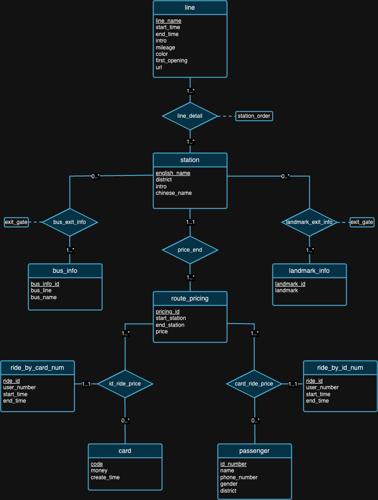

<div align=center>

# Shenzhen Metro

SUSTech 2024 Spring's Projects of Course `CS307 - Principles of Database System`

Divided into two parts as shown below</a>
</div>

### Simplified Directory Path Diagram
```
Shenzhen-Metro
├── Project1                                                            # part 1 of project (database design and data import)
│   ├── ShenzhenMetroDatabaseDesign
│   │   ├── src
│   │   │   ├── main
│   │   │   │   ├── java                                                # import script in java
│   │   │   │   ├── resources                                           # data in json
│   │   │   │   └── sql                                                 # ddl
│   └── ShenzhenMetroDatabaseDesignPython
│       ├── import_script.py                                            # import script in python
│       └── resources                                                   # data in json
├── Project2                                                            # part 2 of project (building an api)
│   ├── DataImport                                                      # updated data import       
│   │   ├── src                                 
│   │   │   ├── main    
│   │   │   │   ├── java                                                # updated import script in java  
│   │   │   │   ├── resources                                           # updated data
│   │   │   │   └── sql                                                 # updated ddl
│   └── ShenzhenMetro                                                   # api built with spring boot
│       ├── src
│       │   ├── main
│       │   │   ├── java                                                # backend logic
│       │   │   │   └── com/sustech/cs307/project2/shenzhenmetro        
│       │   │   │       ├── ShenzhenMetroApplication.java               # main application driver
│       │   │   │       ├── controller                                  # api route mapping
│       │   │   │       ├── dto                                         # dto between client and server
│       │   │   │       ├── object                                      # orm between database tables and application code
│       │   │   │       ├── repository                                  # interfaces for data access
│       │   │   │       └── service                                     # service layer containing business logic
│       │   │   └── resources                                           # frontend logic
│       │   │       ├── application.properties                          # configuration file for spring boot application
│       │   │       ├── static
│       │   │       │   ├── assets
│       │   │       │   │   ├── css                                     
│       │   │       │   │   ├── img
│       │   │       │   │   ├── js
│       │   │       │   │   └── vendor
│       │   │       │   │       ├── aos
│       │   │       │   │       ├── bootstrap
│       │   │       │   │       ├── bootstrap-icons
│       │   │       │   │       ├── glightbox
│       │   │       │   │       └── swiper
│       │   │       │   └── index.html                                  # main html
│       │   │       └── templates                                   
│       │   │           ├── buses
│       │   │           │   ├── create_bus.html
│       │   │           │   ├── index.html
│       │   │           │   └── update_bus.html
│       │   │           ├── landmarks
│       │   │           │   ├── create_landmark.html
│       │   │           │   ├── index.html
│       │   │           │   └── update_landmark.html
│       │   │           ├── lineDetails
│       │   │           │   ├── create_line_detail.html
│       │   │           │   ├── index.html
│       │   │           │   ├── navigate_routes.html
│       │   │           │   └── search_line_detail.html
│       │   │           ├── lines
│       │   │           │   ├── create_line.html
│       │   │           │   ├── index.html
│       │   │           │   └── update_line.html
│       │   │           ├── ongoingRides
│       │   │           │   └── index.html
│       │   │           ├── rides
│       │   │           │   ├── create_ride.html
│       │   │           │   ├── filter_ride.html
│       │   │           │   ├── index.html
│       │   │           │   └── update_ride.html
│       │   │           ├── stations
│       │   │           │   ├── create_station.html
│       │   │           │   ├── index.html
│       │   │           │   └── update_station.html
│       │   │           └── users
│       │   │               ├── card.html
│       │   │               └── passenger.html
└── README.md
```

### Tool Used
#### Part 1
<p align="left">
    <a href="https://www.java.com" target="_blank" rel="noreferrer">
        
    </a>
    <a href="https://www.python.org" target="_blank" rel="noreferrer">
        
    </a>
    <a href="https://www.mysql.com/" target="_blank" rel="noreferrer">
        
    </a>
    <a href="https://www.postgresql.org" target="_blank" rel="noreferrer">
        
    </a>
</p>


#### Part 2
<p align="left">
    <a href="https://en.wikipedia.org/wiki/HTML" target="_blank" rel="noreferrer">
        
    </a>
    <a href="https://en.wikipedia.org/wiki/CSS" target="_blank" rel="noreferrer">
        
    </a>
    <a href="https://getbootstrap.com" target="_blank" rel="noreferrer">
        
    </a>
    <a href="https://www.java.com" target="_blank" rel="noreferrer">
        
    </a>
    <a href="https://spring.io/" target="_blank" rel="noreferrer">
        
    </a>
    <a href="https://www.mysql.com/" target="_blank" rel="noreferrer">
        
    </a>
</p>

## Part 1: Database Design and Data Import
### Requirements
The first part of the project is mainly about designing a database schema that satisfies the principles of relation databases based on the background of the provided data. Once the design phase is complete, we wrote scripts to import those large datasets. To ensure accuracy of the imported data, we had to perform some query statements and checked the query results on the defense day. Besides that, we also ran some experiments with the data to gain some wonderful insights, as shown later.

[*[Read the detailed requirements]*](https://github.com/Layheng-Hok/Shenzhen-Metro/blob/main/ProjectInfo/CS307-Spring24-Project1-Requirements.pdf)

### ER Diagram
<div align="center">
    
</div>

We believe that no database design is perfect. In fact, there are flaws with the design proposed by us in the ER diagram above. We hope you can try to spot them on your own! :)

### Experiments
Table 1: Testing environments
| ID  | OS                          | Chip                          | Memory | SSD   | IDE Tool                                      |
|-----|-----------------------------|-------------------------------|--------|-------|-----------------------------------------------|
| 1   | macOS Sonoma 14.4.1         | Apple M3 Pro                  | 18GB   | 1TB   | IDEA 2024.1 (CE), PyCharm 2023.3.4 (CE), Datagrip 2024.1     |
| 2   | Windows 11 Home 23H2        | 12th Gen Intel(R) Core(TM) i9-12900H | 32GB   | 1TB   | IDEA 2024.1 (CE), Datagrip 2024.1                               |
| 3   | Ubuntu 22.04.4 (VM)         | Apple M1 Pro                  | 16GB   | 512GB | IDEA 2024.1 (CE), Datagrip 2024.1                               |

#### Experiment 1: Different Import Methods

## Method 1 (original script)
This method utilizes the `java.sql` library. Firstly, we established a connection to our PostgreSQL server. Then we read all data from JSON files. Next, we iterated through each datum and created `PreparedStatement` for each insert statement. Lastly, we called the `executeUpdate()` method to execute each statement individually.

## Method 2 (optimized script)
This method also utilizes the `java.sql` library and employs the same data reading algorithm as Method 1. The difference is now we make use of the `executeBatch()` method. So we iterated through the whole data, created each insert statement with `PreparedStatement`, and added each `PreparedStatement` to a batch for a batch execution.

## Method 3 (running a .sql file)
We used a Java program to generate SQL insert statements and wrote them into a `.sql` file by employing the same data reading algorithm mentioned above. Then we run the file in DataGrip.

Since we are using the same data reading algorithm across all three methods, we will use an average runtime for our subsequent tests. We initially gathered three different runtimes—504 ms, 546 ms, and 552 ms—and calculated an average runtime of 534 ms.

## Table 2: Importing methods

| Testing Environment | Method | Average Read Time (ms) | Write Time (ms) | Total Time (ms) | Throughput (statements/s) |
|----------------------|--------|------------------------|-----------------|----------------|---------------------------|
| 1                    | 1      | 534                    | 206396          | 206930         | 8636.91                   |
| 1                    | 2      | 534                    | 2114            | 2648           | 97632.92                  |
| 1                    | 3      | 534                    | 13581           | 14115          | 15197.41                  |

Table 2 illustrates varying performance metrics across different methods, with Method 2 showing the highest throughput and Method 1 having the slowest total time. This makes Method 2 the standard testing method in the upcoming experiments.

