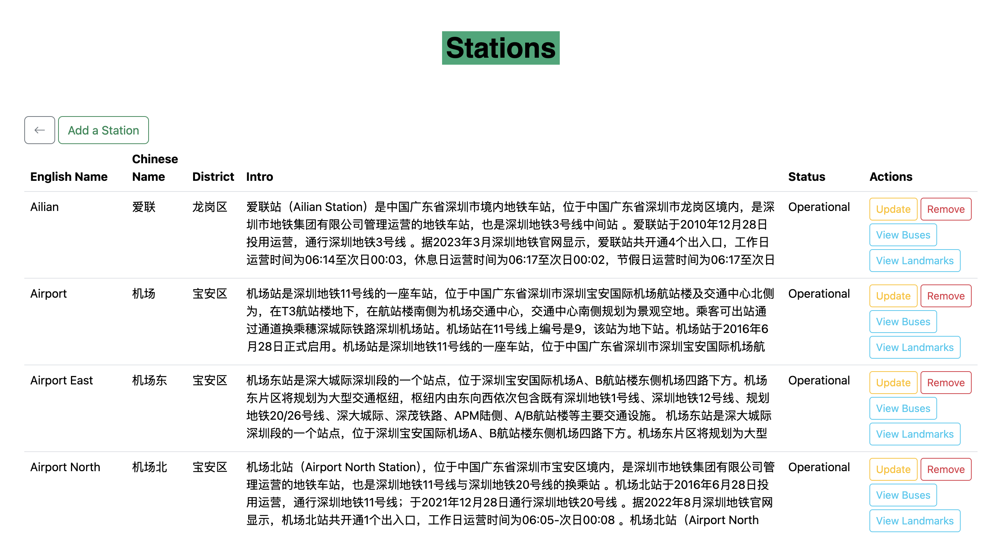
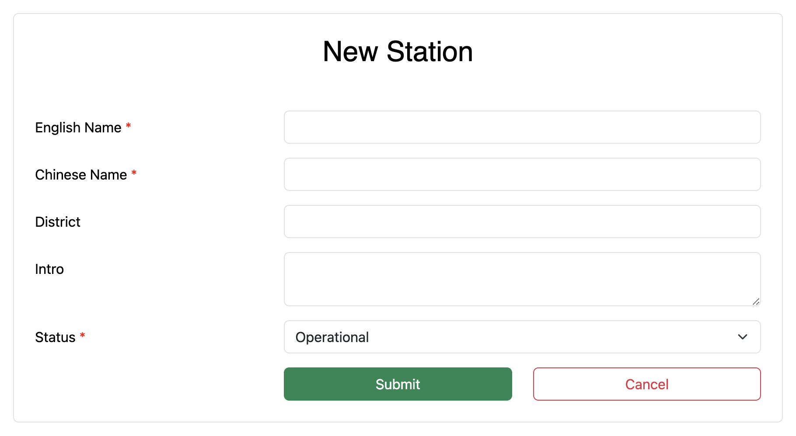
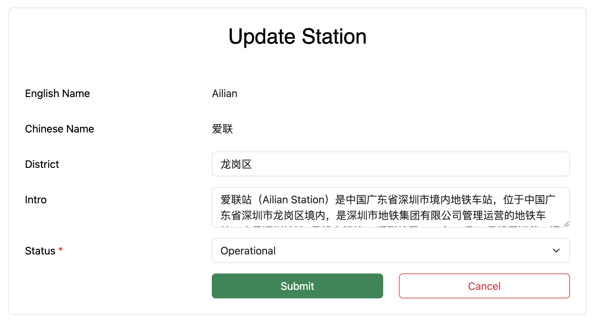

# Project 2's Report of CS307 - Principles of Database Systems  (2024 Spring)

> **Contributors**: ZERHOUNI KHAL Jaouhara (12211456) & HOK Layheng (12210736)  
> **Instructor**: Dr. MA Yuxin  
> **Lab Session**: Tuesday (5-6)


## TABLE OF CONTENTS
[**I. Contribution**](#i-contribution)  
[**II. API Specifications**](#ii-api-specifications)   
[**III. Advanced Requirements**](#iii-advanced-requirements)  
[**IV. Conclusion**](#iv-conclusion)


## I. CONTRIBUTION
| Members                    | Tasks                                                                                                                                                                                                                                                                                                                                                                                                                      | Ratio |
| -------------------------- | -------------------------------------------------------------------------------------------------------------------------------------------------------------------------------------------------------------------------------------------------------------------------------------------------------------------------------------------------------------------------------------------------------------------------- | ----- |
| **ZERHOUNI KHAL Jaouhara** | - Import new data (price)<br>- CRUD on station data<br>- CRUD on line detail data (relationship between stations and lines)<br>- Search for the n-th station’s details that come before or after a specified station on a line<br>- Design a comprehensive system for stations, buses, and landmarks integration<br>- UI/UX design<br>- Report                                                                             | 50%   |
| **HOK Layheng**            | - Set up project and dependencies with Maven<br>- Set up triggers and procedures<br>- Build API with Spring Boot<br>- CRUD on line data<br>- Boarding and exiting functionalities<br>- View information about ongoing rides, passengers, and cards<br>- Utilize the status of stations and different ride classes<br>- Filter ride records with multi-parameter inputs and utilize pagination to handle large ride results | 50%   |

---


##  II. API SPECIFICATIONS

Due to the limitation of page number, in the API specifications below, we are going to explore only the `STATIONS` related API into details by explaining the endpoint, the API method, parameters, a request example, a response example, and possible errors (all errors have been handled). For the rest, we can just go through the endpoint, the API method, and parameters, as we can use `STATIONS` as a reference for other points. Moreover, same or similar parameters will not be explained twice.

### 1. STATIONS

   - **Purpose**: Manages station record.
   - **Use**: Displays all stations, creates new stations, updates existing stations' details, and removes stations from the database.
   - **API**:
     - **Show Station List Page**: Retrieves a list of all stations and displays them on the Stations list page.

        **Endpoint**: `/stations`   
        **Method**: `GET`   
        **Parameters**: `model` (Model: interface, used to pass data from the controller to the view)   
        **Request Example**:  [GET /stations](http://localhost:8080/stations)   
        **Response Example (HTML Page)**:   

        

        **Errors**: None

     - **Show Create Station Page**: Displays the form for creating a new station.

        **Endpoint**: `/stations/create`   
        **Method**: `GET`   
        **Parameters**: `model` (Model)   
        **Request Example**:  [GET /stations/create](http://localhost:8080/stations/create)   
        **Response Example (HTML Form)**:   

        

        **Errors**: None

     - **Create Station**: Creates a new station with the provided details.

        **Endpoint**: `/stations/create`   
        **Method**: `POST`   
        **Parameters**: 
        - `stationDto` (StationDto: object, a Data Transfer Object used to encapsulate the data for a station including the attributes like `englishName` (String, required), `chineseName` (String, required), `district` (String, optional), `intro` (String, optional), and `status` (String, optional)) 
        - `bindingResult` (BindingResult: interface, used to hold the results of a validation and binding operation for a @ModelAttribute StationDto stationDto, containing errors and validation messages if any occurred during the data binding process) 
    
        **Request Example**:    
        ```json
        {
          "englishName": "Central Station",
          "chineseName": "中央车站",
          "district": "Nanshan",
          "intro": "中央车站 (Central Station) has been opened to the public for commuting since June 5th, 2023.",
          "status": "Operational"
        }
        ```
 
        **Response Example**:   
        ```
        HTTP/1.1 302 Found
        Location: redirect:/stations
        ```

        **Errors** (handled):
        ```
        - 400 Bad Request: Missing or invalid parameters.
        - 409 Conflict: Station with the same name already exists.
        ```

     - **Show Update Station Page**: Displays the form for updating the details of an existing station.

        **Endpoint**: `/stations/update`   
        **Method**: `GET`   
        **Parameters**: `englishName` (String, the English name of the station to be updated), `model` (Model)   
        **Request Example**:  [GET /stations/update?englishName=Ailian](http://localhost:8080/stations/update?englishName=Ailian)   
        **Response Example (HTML Form)**:   

        

        **Errors** (handled):
        ```
        - 404 Not Found: Station not found.
        ```

     - **Update Station**: Updates the details of an existing station.

        **Endpoint**: `/stations/update`   
        **Method**: `POST`   
        **Parameters**:  
        - `englishName` (String)         
        - `stationDto` (StationDto: object, a Data Transfer Object used to encapsulate the data for a station including the attributes like `district` (String, optional), `intro` (String, optional), `status` (String, optional)) 
        - `bindingResult` (BindingResult)
        -  `model` (Model) 
          
        **Request Example**:    
        ```json
        {
          "district": "龙岗区",
          "intro": "This is the updated intro.",
          "status": "Closed"
        }
        ```   

        **Response Example**:   
        ```
        HTTP/1.1 302 Found
        Location: redirect:/stations
        ```

        **Errors** (handled):
        ```
        - 400 Bad Request: Missing or invalid parameters.
        ```   
     - **Remove Station**: Removes an existing station.

        **Endpoint**: `/stations/remove`   
        **Method**: `GET`   
        **Parameters**: `englishName` (String, the English name of the station to be removed), `model` (Model)   
          
        **Request Example**:  [GET /stations/remove?englishName=Ailian](http://localhost:8080/stations/remove?englishName=Ailian) 

        **Response Example**:   
        ```
        Location: redirect:/stations
        ```

        **Errors**: None

### 2. LINES

   - **Purpose**: Manages line record.
   - **Use**: Displays all lines, creates new lines, updates existing lines' details, and removes lines from the database.
   - **API**:
     - **Show Line List Page**: Retrieves a list of all lines and displays them on the Lines list page.

        **Endpoint**: `/lines`   
        **Method**: `GET`   
        **Parameters**: `model` (Model)
       
     - **Show Create Line Page**: Displays the form for creating a new line.

        **Endpoint**: `/lines/create`   
        **Method**: `GET`   
        **Parameters**: `model` (Model)   
       
     - **Create Line**: Creates a new line with the provided details.

        **Endpoint**: `/lines/create`   
        **Method**: `POST`   
        **Parameters**: 
        - `lineDto` (LineDto: object, a Data Transfer Object used to encapsulate the data for a line) 
        - `bindingResult` (BindingResult)

     - **Show Update Line Page**: Displays the form for updating the details of an existing line.

        **Endpoint**: `/lines/update`   
        **Method**: `GET`   
        **Parameters**: `id` (int, the ID of the line to be updated), `model` (Model)      

     - **Update Line**: Updates the details of an existing line.

        **Endpoint**: `/lines/update`   
        **Method**: `POST`   
        **Parameters**: `id` (int), `lineDto` (LineDto), `bindingResult` (BindingResult), `model` Model   

     - **Remove Line**: Removes an existing line.

        **Endpoint**: `/lines/remove`   
        **Method**: `GET`   
        **Parameters**: `lineName` (String, the line name to be removed), `model` (Model)  
 
### 3. LINE DETAILS: LINES AND STATIONS MANAGEMENT
   - **Purpose**: Manages the relationship between lines and stations.
   - **Use**: Displays line details, place one or more station(s) at a specified location on a line, and removes a station from a line.
   - **API**: 
     - **Show Line Detail List Page**: Retrieves a list of all lines and stations displays them on the Line Details list page.

        **Endpoint**: `/lineDetails`   
        **Method**: `GET`   
        **Parameters**: `model` (Model)

     - **Show Line Detail Create Page**: Displays the form for adding one or more new stations on any specified lines.

        **Endpoint**: `/lineDetails/create`   
        **Method**: `GET`   
        **Parameters**: `model` (Model), `numStations` (Integer, used to request the total number of stations to be added) `totalStationsToAdd` (Integer, used to keep track of the total number of stations to be added), `stationsAdded` (Integer, used to keep track of the number of stations that have been added so far) 
       
     - **Create Line Detail**: Creates a new station at a specified line.

        **Endpoint**: `/lineDetails/create`   
        **Method**: `POST`   
        **Parameters**: 
        - `lineDetailDto` (LineDetailDto: object, a Data Transfer Object used to encapsulate the data for a station including the attributes like `lineName` (String, required), `stationName` (String, required), `stationOrder` (integer, required))
        - `bindingResult` (BindingResult)
        - `model` (Model) 
        - `totalStationsToAdd` (Integer)
        - `stationsAdded` (Integer)
        - `sessionStatus` (SessionStatus, utilize 'setComplete' to remove session attributes and end the session when the user is done adding new line details)  
        
      - **Remove Station From Line Detail**: Removes a station from a line.

        **Endpoint**: `/lineDetails/remove`   
        **Method**: `GET`   
        **Parameters**: `id` (int, the ID of the line detail to be removed), `model` (Model)

     - **Show Search Station Page**: Displays the form for searching for a specific station.

        **Endpoint**: `/lineDetails/search`   
        **Method**: `GET`   
        **Parameters**: `model` (Model)

     - **Search Station**: Finds a station with the provided details.

        **Endpoint**: `/lineDetails/search`   
        **Method**: `POST`   
        **Parameters**: 
        - `lineDetailSearchDto` (LineDetailSearchDto: object, a Data Transfer Object used to encapsulate the data for a station including the attributes like `lineName` (String, required), `stationName` (String, required), `offset` (integer, required))
        - `bindingResult` (BindingResult)
        - `model` (Model)  

     
### 4. BUSES AND LANDMARKS

Due to similarities between the implementations of buses and landmarks, we will mention them together.
   - **Purpose**: Manages the integration between stations, buses, and landmarks
   - **Use**: Within a specific station: displays buses or landmarks, creates buses or landmarks, updates buses or landmarks, removes buses or landmarks.
   - **API**:  
     - **Show Bus or Landmark List Page**: Retrieves a list of all buses or landmarks of a specific station

        **Endpoint**: `/buses` or `/landmarks`  
        **Method**: `GET`   
        **Parameters**: `englishName` (String, a requested parameter for getting the name of a specific station), `model` (Model)   
     
     - **Show Bus or Landmark Create Page**: Displays the form for adding one or more new buses or landmarks on a specified station.

        **Endpoint**: `/buses/create` or `/landmarks/create`  
        **Method**: `GET`   
        **Parameters**: `model` (Model), `numBuses` or `numLandmarks`(Integer, used to request the total number of buses or landmarks to be added) `totalBusesToAdd` or `totalLandmarksToAdd`(Integer, used to keep track of the total number of buses or landmarks to be added), `busesAdded` or `landmarksAdded` (Integer, used to keep track of the number of buses or landmarks that have been added so far) 
       
     - **Create Bus or Landmark**: Creates a new bus or landmark at a specified line.

        **Endpoint**: `/buses/create` or `/landmarks/create` 
        **Method**: `POST`   
        **Parameters**: 
        - `busExitInfoDto` (BusExitInfoDto: object, a Data Transfer Object used to encapsulate the data for a bus) or `landmarkExitInfoDto`(LandmarkExitInfoDto: object, a Data Transfer Object used to encapsulate the data for a landmark)
        - `bindingResult` (BindingResult)
        - `model` (Model) 
        - `totalBusesToAdd` or `totalLandmarksToAdd`(Integer)
        - `busesAdded` or `landmarksAdded` (Integer) 

     - **Show Update Bus or Landmark Page**: Displays the form for updating the details of an existing bus or landmark.

        **Endpoint**: `/buses/update` or `/landmarks/update`
        **Method**: `GET`   
        **Parameters**: `id` (long, the ID of the bus or landmark to be updated), `model` (Model)      

     - **Update Bus or Landmark**: Updates the details of an existing bus or landmark.

        **Endpoint**: `/buses/update` or `/landmarks/update`   
        **Method**: `POST`   
        **Parameters**: `id` (long), `busExitInfoDto` (BusExitInfoDto) or `landmarkExitInfoDto` (LandmarkExitInfoDto), `bindingResult` (BindingResult), `model` Model 

     - **Remove Bus or Landmark**: Removes a bus or a landmark from a station.

        **Endpoint**: `/buses/remove` or `/landmarks/remove`   
        **Method**: `GET`   
        **Parameters**: `id` (long, the ID of the bus or landmark to be removed), `model` (Model)

### 5. RIDES
   - **Purpose**: Manages ride record. 
   - **Use**: Displays ride record and ongoing rides, boards a ride, exits a ride, filters rides
   - **API**:
     - **Show Ride Page**: Retrieves a list of all rides

        **Endpoint**: `/rides`   
        **Method**: `GET`   
        **Parameters**: `model` (Model), `page` (int, default: 0, current page number for pagination), `size` (int, default: 100, number of items per page)
     
     - **Show Create Ride Page**: Displays the form for creating a new ride.

        **Endpoint**: `/rides/create`   
        **Method**: `GET`   
        **Parameters**: `model` (Model)   
     
     - **Create Ride or Boarding Functionality**: Creates a new ride with the provided details.

        **Endpoint**: `/rides/create`   
        **Method**: `POST`   
        **Parameters**: 
        - `rideDto` (RideDto: object, a Data Transfer Object used to encapsulate the data for a ride)
        - `bindingResult` (BindingResult)
     - **Show Update Ride Page**: Displays the form for updating exiting station of an ongoing ride.

        **Endpoint**: `/rides/update`   
        **Method**: `GET`   
        **Parameters**: `id` (long, the ID of the ride to be updated), `model` (Model)   
     
     - **Update Ride or Exiting Functionality**: Adds the exiting station of an ongoing ride.

        **Endpoint**: `/rides/update`   
        **Method**: `POST`   
        **Parameters**: `id` (long), `rideDto` (RideDto), `bindingResult` (BindingResult)
     
     - **Filter Rides**: Search ride record based on multiple parameters.

        **Endpoint**: `/rides/filter`   
        **Method**: `POST`   
        **Parameters**:
        - `rideFilterDto` (RideFilterDto: object, a Data Transfer Object used to encapsulate the data for a ride with some constraints different from RideDto)
        - `bindingResult` (BindingResult)
        - `model` (Model)
        - `page`  (int)
        - `size` (int)    

     - **Show Ongoing Ride Page**: Retrieves a list of all ongoing rides.

        **Endpoint**: `/rides/ongoingRides`   
        **Method**: `GET`   
        **Parameters**: `model` (Model)

### 6. USERS: PASSENGERS AND CARDS
   - **Purpose**: Display information about passengers or cards.
   - **Use**: View the detailed information of a passenger or a card.
  - **API**:
     - **Get User Details**: Retrieves a detailed information about a user (a passenger or a card).

        **Endpoint**: `/users/{userNum}`   
        **Method**: `GET`   
        **Parameters**: `userNum` (String, a requested parameter to get the ID of a specific passenger or card), `model` (Model)   
       

##  III. ADVANCED REQUIREMENTS

- **Database Implementation**: 
  - **Requirement**: Completes the project using OpenGauss or MySQL database.
  - **Implementation**: The project utilizes MySQL database to manage and store all necessary data including stations, lines, line details, buses and landmarks, card or passenger details, pricing information, and ride record.

- **Station Status Management**: 
  - **Requirement**: Adds and appropriately utilizes the status of stations (e.g., under construction, operational, closed).
  - **Implementation**: Extended the station management system to include status indicators. Stations can now have statuses like "Operational", "Under construction", and "Closed". These statuses are stored in the database and can be updated via API endpoints. When a station is removed, its status becomes "Closed". When a station is not "Operational", the station cannot be used to create a new ride.

- **Economy and Business Classes Of Subway Rides**: 
  - **Requirement**: Utilizes differnt calsses of a subway ride.
  - **Implementation**: Added a new feature that designates a certain ride as an economy or business class. While exiting a ride with an economy class, the ride price is the default price between two stations given in `Price.xlsx`. While exiting a ride with a business class, the ride price is the standard economy price between two stations with a 50% increase of the original price.

- **Integration of Buses, Landmarks, and Stations**: 
  - **Requirement**: Establishes a comprehensive system to integrate buses, landmarks, and stations.
  - **Implementation**: Developed an integrated transport management system that allows queries for buses, landmarks, and stations. Users can view bus or landmark details associated with any specific subway stations. Moreover, users can create, update, or remove multiple buses or landmarks from a specific station. The detailed API implementation is explained in section [**II-4**](#4-buses-and-landmarks).

- **Multi-Parameter Search for Ride Record**: 
  - **Requirement**: Enables searching ride records based on multiple parameters.
  - **Implementation**: Created a robust search functionality in the API that allows users to search ride records based on various parameters such as user's number, ride duration, start and end station, ride class, and price. The detailed API implementation is explained in [**II-5**](#5-rides).


- **Package Management**: 
  - **Tool Used**: Maven
  - **Implementation**: Maven was used for managing project dependencies, ensuring all required libraries and tools were included and properly configured in the project.

- **Using HTTP/RESTful Web**: 
  - **Tool Used**: Spring Boot
  - **Implementation**: Developed a backend server using Spring Boot to handle HTTP/RESTful requests. This allows the application to support various API endpoints for managing stations, lines, passenger details, and more. The detailed API implementation is explained in [**II**](#ii-api-specifications).

- **Using Backend Frameworks or ORM Mapping**: 
  - **Tool Used**: JPA (Jakarta Persistence API) with Spring Boot
  - **Implementation**: Used JPA by Spring Boot for Object-Relational Mapping (ORM) to interact with the MySQL database. This simplifies database operations by allowing developers to work with Java objects instead of raw SQL queries. Annotations used in the project include but not limited to `@Id`, `@Column`, `@Entity`, and so on. 

- **Big Data Management**:
  - **Requirement**: Implements big data management to efficiently handle large datasets.
  - **Implementation**: Utilized pagination to display large data sets in manageable pages. Specifically in the ride table, large datasets are broken into pages with each page fetching 100 rows of data. This approach ensures that the system remains responsive and the data is easily navigable for users.

- **Page Display Design**:
  - **Requirement**: Ensures the GUI design presents data effectively and aesthetically.
  - **Implementation**: Data are presented in either tables or cards. The webpage was built with Bootstrap, having a visually appealing and beautiful interface with responsive layout and interactive elements.

- **Effective Presentation and Communication**:
  - **Requirement**: Ensures effective presentation and communication of data and functionalities.
  - **Implementation**: With the responsive layout, the design is optimized to work seamlessly across all forms of devices, including mobiles, tablets, and desktops. With that and smooth scrolling, the webpage provides a user-friendly, intuitive, and engaging experience for users.

- **Appropriate Usage of Database Functionalities**:
  - **Requirement**: Appropriately utilizes database procedures, triggers and indexes.
  - **Implementation**:   
     - **Procedures**: Created stored procedures to handle insert, update, and delete operations related to the ride table, ensuring proper synchronization with the ongoing_ride table.   
  
     - **Triggers**: Implemented triggers to automate and enforce rules for insertions, updates, and deletions in the ride table, ensuring consistency with the ongoing_ride table.

     - **Indexes**: Utilized primary keys and unique constraints which implicitly create indexes, optimizing query performance for key operations.

- **Transaction**:
  - **Requirement**: Utilizes transation where necessary.
  - **Implementation**: To ensure data integrity in the presence of operation failures, JPA's `@Transational` attribute is used on any Java methods that require to modify data in the database, including but not limited to update and delete operations.


  ##  IV. CONCLUSION

     In this project, we successfully designed and implemented a comprehensive subway management system that meets both basic and advanced requirements. We utilized a variety of technologies including MySQL and Spring Boot, and effectively integrated multiple functionalities such as station and line management, ride recording, and passenger information handling. Our system also incorporates advanced features like business carriage management, integration with buses and landmarks, and robust search capabilities. The project's efficient handling of large datasets, interactive UI/UX design, and adherence to database best practices demonstrate a solid understanding of database systems principles and associated technologies. This project highlights our ability to work collaboratively and deliver a functional, user-friendly webpage.
